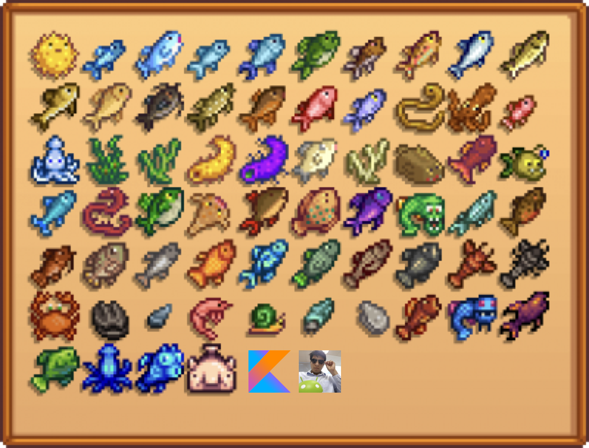

# ALL ABOUT COLLECTIONS IN KOTLIN

  

There are a lost of operations that you can do with collection in Kotlin. 
So the dream is to know each of them and be a better developer ever.

    * filter
    * filterIndexed
    * filterIndexedTo
    * filterIsInstance
    * filterNot
    * filterNotNull
    * filterNotNullTo
    * filterNotTo
    * filterTo
    * findLast
    * first
    * firstOrNull
    * flatMap
    * flatMapTo
    * flatten
    * fold
    * forEach
    * forEachIndexed
    * minus
    * minusAssign
    * plus
    * plusAssign
    * reduce